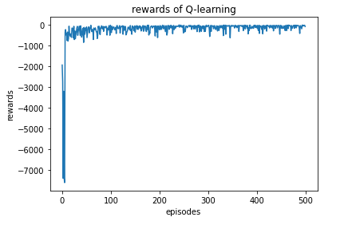
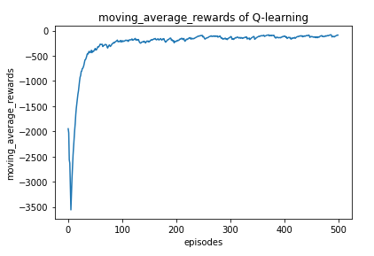

<center>训练奖励</center>



<center>训练滑动平均奖励</center>

```python
"""超参数设置如下"""
class Config:
    def __init__(self):
        self.policy_lr = 0.01
        self.gamma = 0.8
        self.train_eps = 500
        self.start_epsilon = 0.9
        self.end_epsilon = 0.1
        self.decay_epsilon = 300
```

