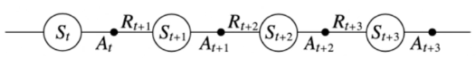
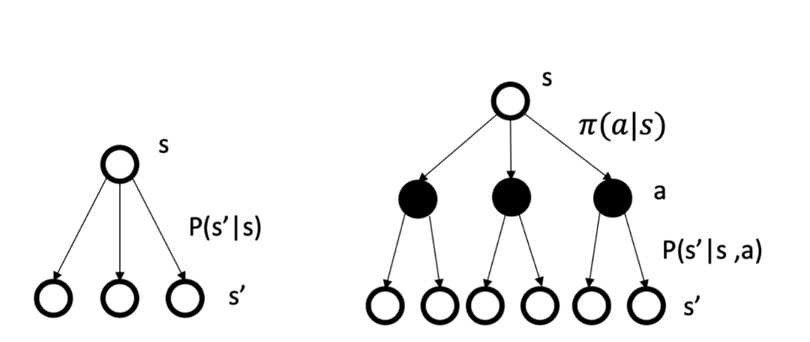
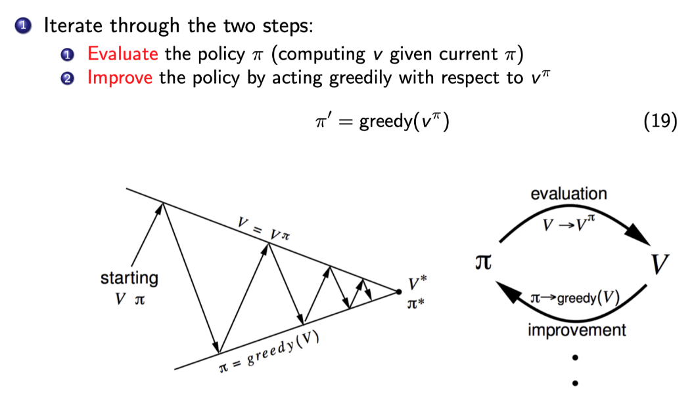
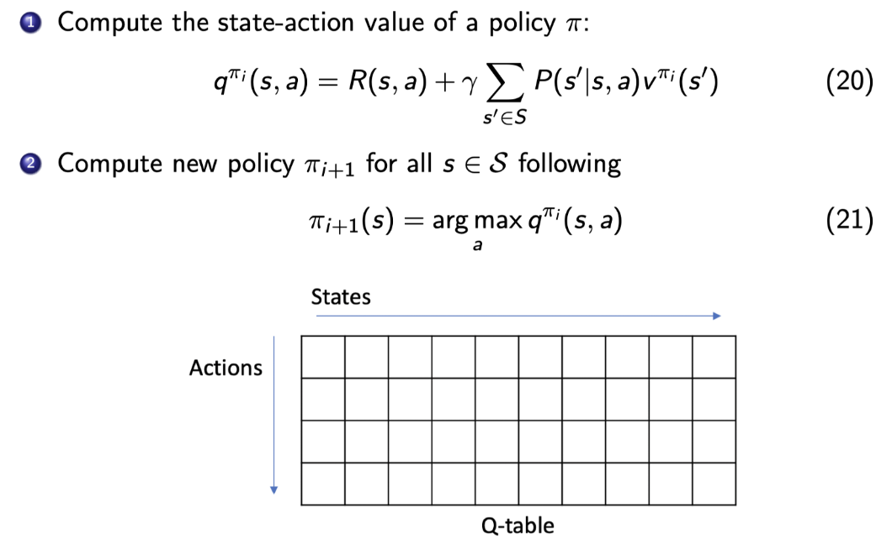
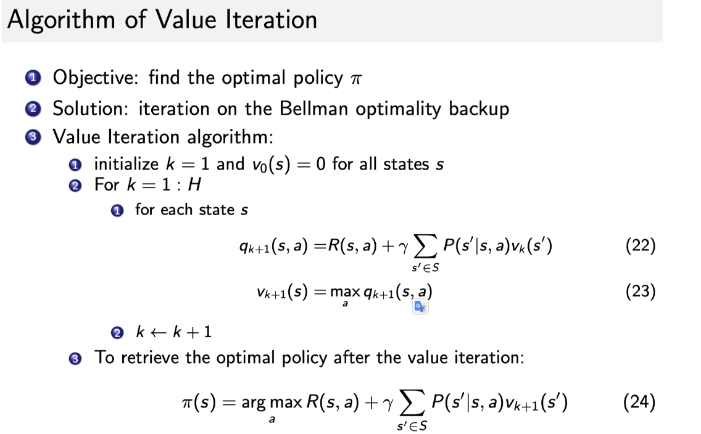

# 2 马尔科夫决策过程（MDP）

## 2.1 马尔科夫过程

- 设状态历史$h_{\mathrm{t}}=\left\{\mathrm{s}_{1}, \mathrm{~s}_{2}, \mathrm{~s}_{3}, \ldots, \mathrm{s}_{\mathrm{t}}\right\}$，如果一个状态符合马尔科夫过程，则满足以下条件：
  $$
  \begin{aligned}
  p\left(s_{t+1} \mid s_{t}\right) &=p\left(s_{t+1} \mid h_{t}\right) \\
  p\left(s_{t+1} \mid s_{t}, a_{t}\right) &=p\left(s_{t+1} \mid h_{t}, a_{t}\right)
  \end{aligned}
  $$

​		以上关系被称为**马尔科夫性质**，是所有MP的基础。

- 状态转移矩阵可以用来描述状态转移概率$\mathrm{p}\left(\mathrm{s}_{\mathrm{t}+1}=\mathrm{s}^{\prime} \mid \mathrm{s}_{\mathrm{t}}=\mathrm{s}\right)$。

## 2.2 马尔科夫奖励过程

- 与MP类似，达到每个状态对应一个奖励。

- **Return**：$\mathrm{G}_{\mathrm{t}}=\mathrm{R}_{\mathrm{t}+1}+\gamma \mathrm{R}_{\mathrm{t}+2}+\gamma^{2} \mathrm{R}_{\mathrm{t}+3}+\gamma^{3} \mathrm{R}_{\mathrm{t}+4}+\ldots+\gamma^{\mathrm{T}-\mathrm{t}-1} \mathrm{R}_{\mathrm{T}}$

  

- 状态价值，定义为Return的期望：
  $$
  \begin{aligned}
  \mathrm{V}_{\mathrm{t}}(\mathrm{s}) &=\mathbb{E}\left[\mathrm{G}_{\mathrm{t}} \mid \mathrm{s}_{\mathrm{t}}=\mathrm{s}\right] \\
  &=\mathbb{E}\left[\mathrm{R}_{\mathrm{t}+1}+\gamma \mathrm{R}_{\mathrm{t}+2}+\mathrm{\gamma}^{2} \mathrm{R}_{\mathrm{t}+3}+\ldots+\mathrm{\gamma}^{\mathrm{T}-\mathrm{t}-1} \mathrm{R}_{\mathrm{T}} \mid \mathrm{s}_{\mathrm{t}}=\mathrm{s}\right]
  \end{aligned}
  $$

- 折扣系数$\gamma$意义

  - 避免带环马尔科夫过程带来的无穷奖励。
  - 降低对不确定性未来的奖励。
  - 模拟人的行为，期望获得及时奖励。

- Bellman Equation：
  $$
  \mathrm{V}(\mathrm{s})=\underbrace{\mathrm{R}(\mathrm{s})}_{\text {Immediate reward }}+\underbrace{\mathrm{\gamma} \sum_{\mathrm{s}^{\prime} \in \mathrm{S}} \mathrm{P}\left(\mathrm{s}^{\prime} \mid \mathrm{s}\right) \mathrm{V}\left(\mathrm{s}^{\prime}\right)}_{\text {Discounted sum of future reward }}
  $$

- Bellman Equation矩阵的解析解：
  $$
  \mathrm{V}=(\mathrm{I}-\gamma \mathrm{P})^{-1} \mathrm{R}
  $$

- MRP迭代解：

  - 蒙特卡罗方法计算价值函数：

    采样$G_t$，对不同轨迹在同一点的$G_t$求期望得最后的价值。

  - 动态规划方法求价值函数：

    一直按照Bellman方程去更新值函数，直到收敛。

## 2.3 MDP

- 输入变量多了一个动作。

- $\pi(\mathrm{a} \mid \mathrm{s})=\mathrm{P}\left(\mathrm{a}_{\mathrm{t}}=\mathrm{a} \mid \mathrm{s}_{\mathrm{t}}=\mathrm{s}\right)$衡量动作概率。

- MDP转移函数推导：
  $$
  \mathrm{P}^{\pi}\left(\mathrm{s}^{\prime} \mid \mathrm{s}\right)=\sum_{\mathrm{a} \in \mathrm{A}} \pi(\mathrm{a} \mid \mathrm{s}) \mathrm{P}\left(\mathrm{s}^{\prime} \mid \mathrm{s}, \mathrm{a}\right)
  $$

- MDP和MP差异

  

- MDP的值函数
  $$
  \mathrm{q}^{\pi}(\mathrm{s}, \mathrm{a})=\mathbb{E}_{\mathrm{\pi}}\left[\mathrm{G}_{\mathrm{t}} \mid \mathrm{s}_{\mathrm{t}}=\mathrm{s}, \mathrm{A}_{\mathrm{t}}=\mathrm{a}\right]
  $$

- Q函数的Bellman方程
  $$
  \mathrm{q}(\pi,a)=\mathrm{R}(\mathrm{s}, \mathrm{a})+\mathrm{\gamma} \sum_{\mathrm{s}^{\prime} \in \mathrm{S}} \mathrm{P}\left(\mathrm{s}^{\prime} \mid \mathrm{s}, \mathrm{a}\right) \mathrm{V}\left(\mathrm{s}^{\prime}\right)
  $$

- V函数和Q函数关系
  $$
  \mathrm{v}^{\pi}(\mathrm{s})=\sum_{\mathrm{a} \in \mathrm{A}} \pi(\mathrm{a} \mid \mathrm{s}) \mathrm{q}^{\pi}(\mathrm{s}, \mathrm{a})
  $$

- Bellman期望方程
  $$
  v^{\pi}(s)=\sum_{a \in A} \pi(a \mid s)\left(R(s, a)+\gamma \sum_{s^{\prime} \in S} P\left(s^{\prime} \mid s, a\right) v^{\pi}\left(s^{\prime}\right)\right)\\
  \mathrm{q}^{\pi}(\mathrm{s}, \mathrm{a})=\mathrm{R}(\mathrm{s}, \mathrm{a})+\mathrm{\gamma} \sum_{\mathrm{s}^{\prime} \in \mathrm{S}} \mathrm{P}\left(\mathrm{s}^{\prime} \mid \mathrm{s}, \mathrm{a}\right) \sum_{\mathrm{a}^{\prime} \in \mathrm{A}} \pi\left(\mathrm{a}^{\prime} \mid \mathrm{s}^{\prime}\right) \mathrm{q}^{\pi}\left(\mathrm{s}^{\prime}, \mathrm{a}^{\prime}\right)
  $$

- Policy Evaluation：预测策略未来能产生的奖励。

- MDP分为预测问题和控制问题，通过解决预测问题，从而解决控制问题：
  - 预测问题给定策略求价值函数。
  - 控制问题求最优策略及对应的最优价值函数。

- 动态规划只能解决规划问题（planning），必须对环境完全已知，这样动态规划结果才能收敛。

- 最佳policy定义：
  $$
  \pi^{*}(a \mid s)= \begin{cases}1, & \text { if } a=\arg \max _{a \in A} q^{*}(s, a) \\ 0, & \text { otherwise }\end{cases}
  $$

  - 搜索最佳策略常用方法：

    - policy iteration

      

      

      新的价值等式，上式成为Bellman optimality equation：
      $$
      v^{\pi}(s)=\max _{\mathrm{a} \in \mathcal{A}} \mathrm{q}^{\pi}(\mathrm{s}, \mathrm{a})
      $$

    ​       可以据此推出Q Learning的公式：

    ​				
    $$
    \mathrm{q}^{*}(\mathrm{~s}, \mathrm{a})=\mathrm{R}(\mathrm{s}, \mathrm{a})+\mathrm{\gamma} \sum_{\mathrm{s}^{\prime} \in \mathrm{S}} \mathrm{P}\left(\mathrm{s}^{\prime} \mid \mathrm{s}, \mathrm{a}\right) \max _{\mathrm{a}^{\prime}} \mathrm{q}^{*}\left(\mathrm{~s}^{\prime}, \mathrm{a}^{\prime}\right)
    $$

    - value iteration

      将Bellman optimality equation当作一个update rule：
      $$
      \mathrm{v}(\mathrm{s}) \leftarrow \max _{\mathrm{a} \in \mathcal{A}}\left(\mathrm{R}(\mathrm{s}, \mathrm{a})+\mathrm{\gamma} \sum_{\mathrm{s}^{\prime} \in \mathcal{S}} \mathrm{P}\left(\mathrm{s}^{\prime} \mid \mathrm{s}, \mathrm{a}\right) \mathrm{v}\left(\mathrm{s}^{\prime}\right)\right)
      $$
      

      

      目前只是在解决planning问题，因为知道环境确切信息，而不是在解决强化学习问题。

      中间状态的value没有意义，因为不能表示完整的value。

      

