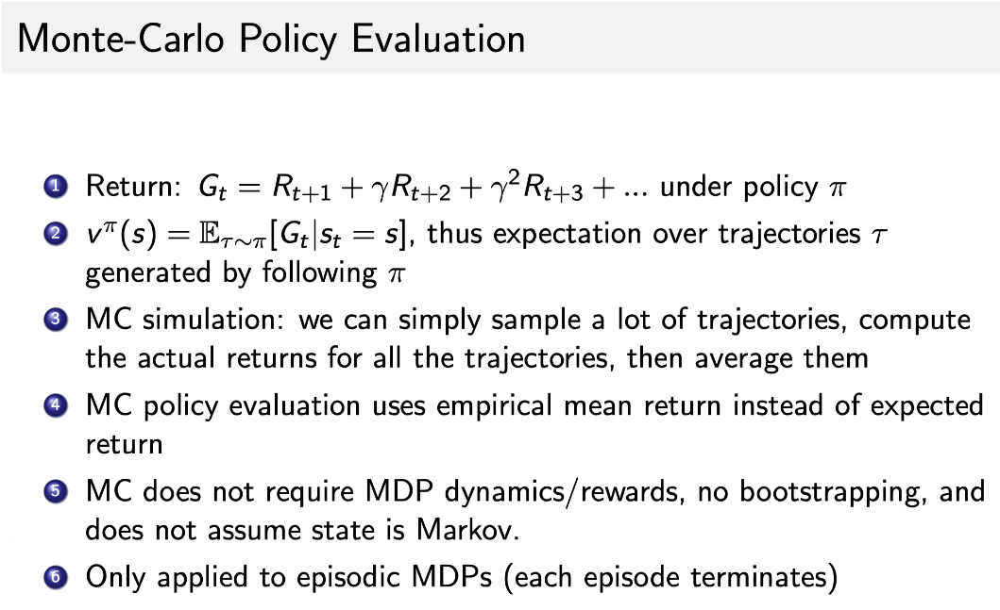
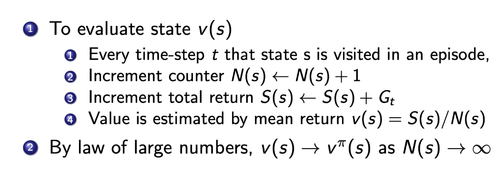
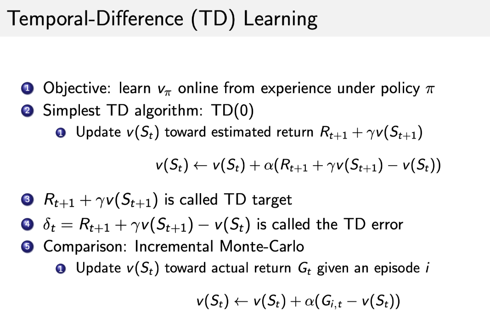
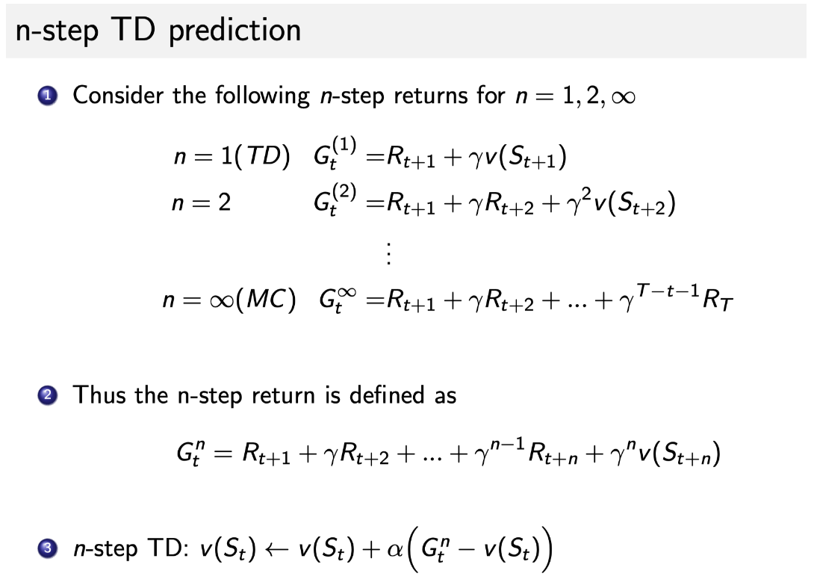
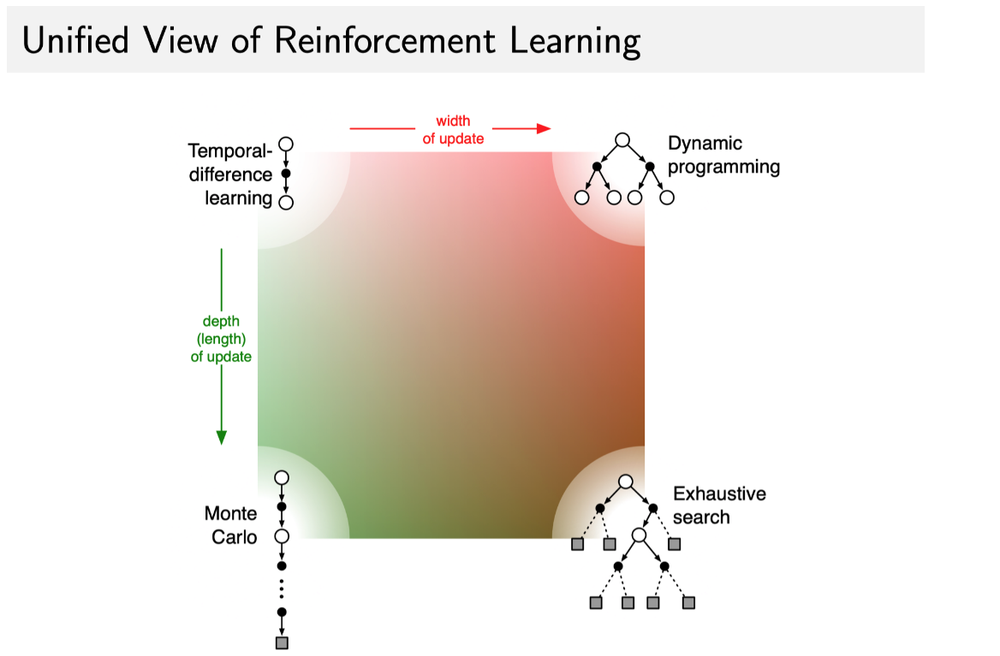
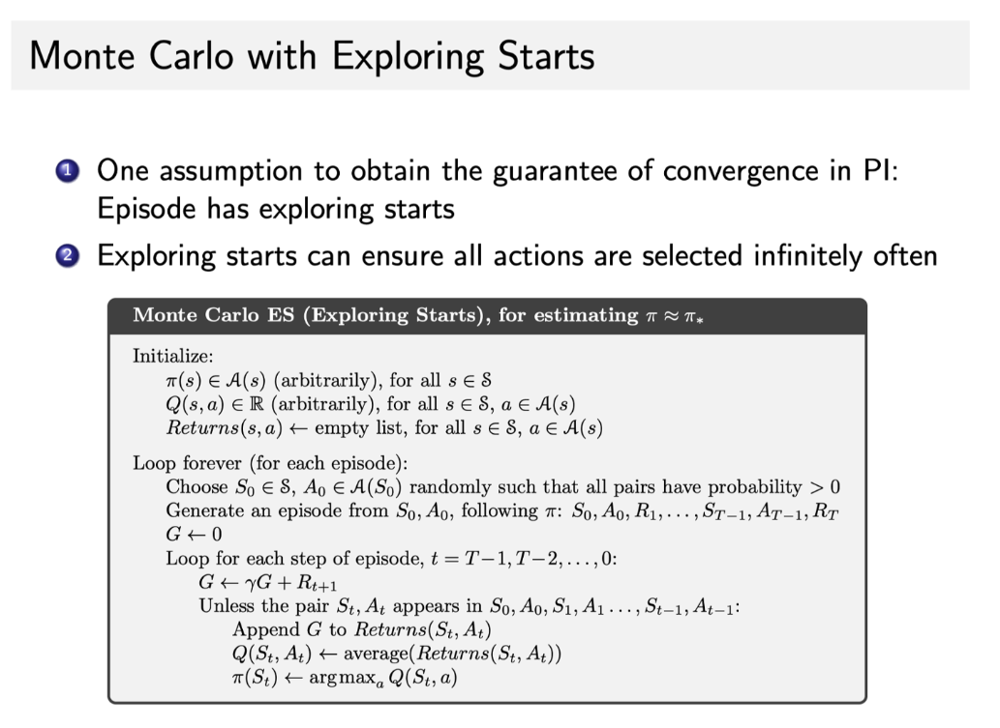
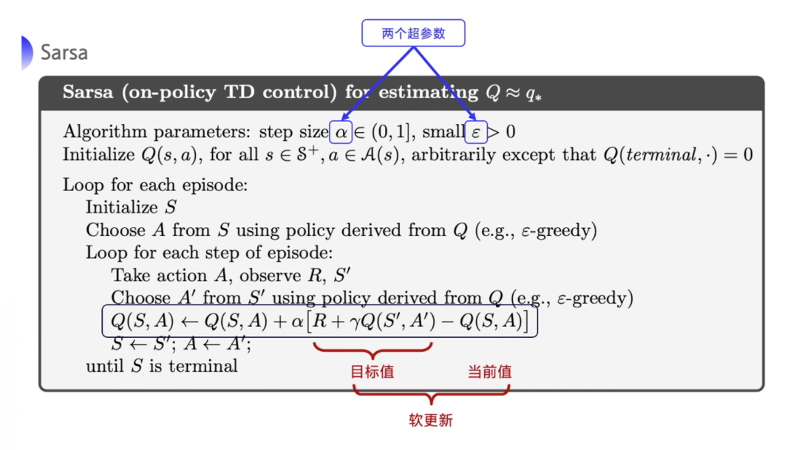
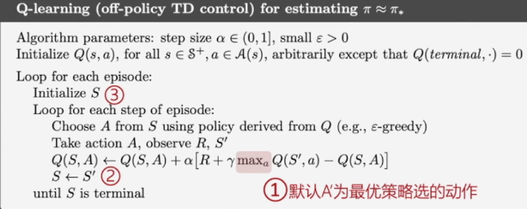
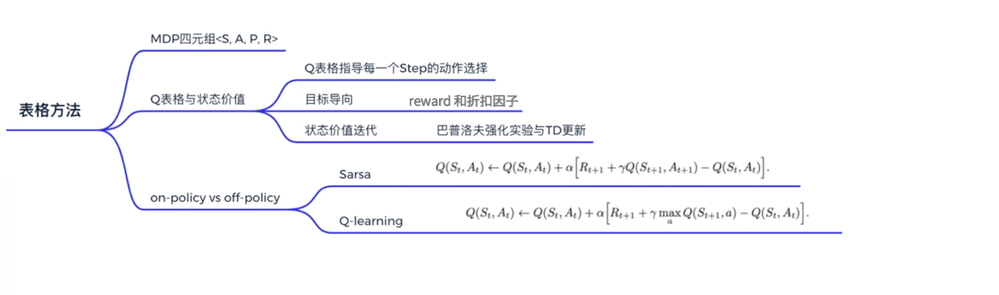

# 3 表格型方法

## 3.1 MDP

- 当我们知道概率函数和奖励函数时，我们就说这个 MDP 是已知的，可以通过 policy iteration 和 value iteration 来找最佳的策略。

- model-free是处理未知环境的算法，现实生活中模型的概率要么未知要么太过复杂无法计算。

- model-free方法让agent与环境交互采集轨迹数据，从轨迹中获取信息改进策略，从而获得更多奖励。

## 3.2 Q表格

- Q表格指导每一个step的动作选择。

## 3.3 Model-free Prediction

- ### Monte-Carlo Policy Evaluation

  局限性：只能用在有限步骤游戏中

  

  

  比较MC和DP：

  - MC 可以在不知道环境的情况下 work，而 DP 是 model-based。
  - MC 只需要更新一条轨迹的状态，而 DP 则是需要更新所有的状态。状态数量很多的时候（比如一百万个，两百万个），DP 这样去迭代的话，速度是非常慢的。这也是 sample-based 的方法 MC 相对于 DP 的优势。

- **Temporal Difference(TD) learning**

  

- 比较TD和MC
  - TD 可以在线学习(online learning)，每走一步就可以更新，效率高。
  - MC 必须等游戏结束才可以学习。
  - TD 可以从不完整序列上进行学习。
  - MC 只能从完整的序列上进行学习。
  - TD 可以在连续的环境下（没有终止）进行学习。
  - MC 只能在有终止的情况下学习。
  - TD 利用了马尔可夫性质，在马尔可夫环境下有更高的学习效率。
  - MC 没有假设环境具有马尔可夫性质，利用采样的价值来估计某一个状态的价值，在不是马尔可夫的环境下更加有效。

- n-Step TD prediction

  

- 一图看懂TD、DP、MC、穷举方法区别：

  

## 3.2 Model-free Control

- MC估计Q函数算法

  

- $\epsilon$-greedy算法：平衡探索和利用，随着训练次数增加，可以降低$\epsilon$值。
- 与MC相比TD的优势：
  - 低方差。
  - 能够在线学习。
  - 能够从不完整的序列学习。

- TD估计Q函数算法

  - SARSA算法：需要知道$\left(\mathrm{S}_{\mathrm{t}}, \mathrm{A}_{\mathrm{t}}, \mathrm{R}_{\mathrm{t}+1}, \mathrm{~S}_{\mathrm{t}+1}, \mathrm{~A}_{\mathrm{t}+1}\right)$。

    

  - n-step SARSA：类似于n-step TD。

- Q Learning：Off-policy TD Control

  - 目标策略和行为策略分离。
  - Target policy 就像是在后方指挥战术的一个军师，它可以根据自己的经验来学习最优的策略，不需要去和环境交互。
  - 另外一个策略是探索环境的策略，即`behavior policy(行为策略)`，一般用 $\mu$ 来表示。$\mu$ 可以大胆地去探索到所有可能的轨迹，采集轨迹，采集数据，然后把采集到的数据喂给 target policy 去学习。而且喂给目标策略的数据中并不需要$A_{t+1}$。
  - 在 off-policy learning 的过程中，我们这些轨迹都是 behavior policy 跟环境交互产生的，产生这些轨迹后，我们使用这些轨迹来更新 target policy $\pi$。

  - 我们可以利用 exploratory policy 来学到一个最佳的策略，学习效率高；

  - 可以让我们学习其他 agent 的行为，模仿学习，学习人或者其他 agent 产生的轨迹；

  - 重用老的策略产生的轨迹。探索过程需要很多计算资源，这样的话，可以节省资源。

  - Target policy $\pi$ 直接在 Q-table 上取 greedy，就取它下一步能得到的所有状态，如下式所示：
    $$
    \pi\left(\mathrm{S}_{\mathrm{t}+1}\right)=\underset{\mathrm{a}^{\prime}}{\arg \max } \mathrm{Q}\left(\mathrm{S}_{\mathrm{t+1}}, \mathrm{a}^{\prime}\right)
    $$

  - Behavior policy $\mu$ 采用$\epsilon$-greedy策略。

  

- 对比Q Learning和SARSA：
  - SARSA当前更新Q表用的动作就是下一步的动作。
  - Q Learning更新当前Q表用的动作是最优动作，动作选取不一样。

## 3.3 On-policy vs. Off-policy

- SARSA很胆小，不太稳定，但是迭代很平稳。
- Q Learning探索时更大胆，更可能探索到最优策略。

