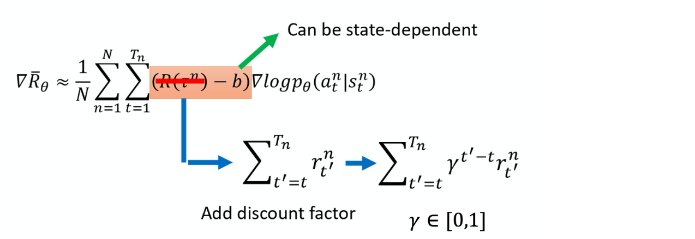
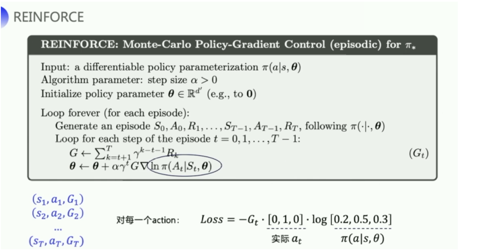
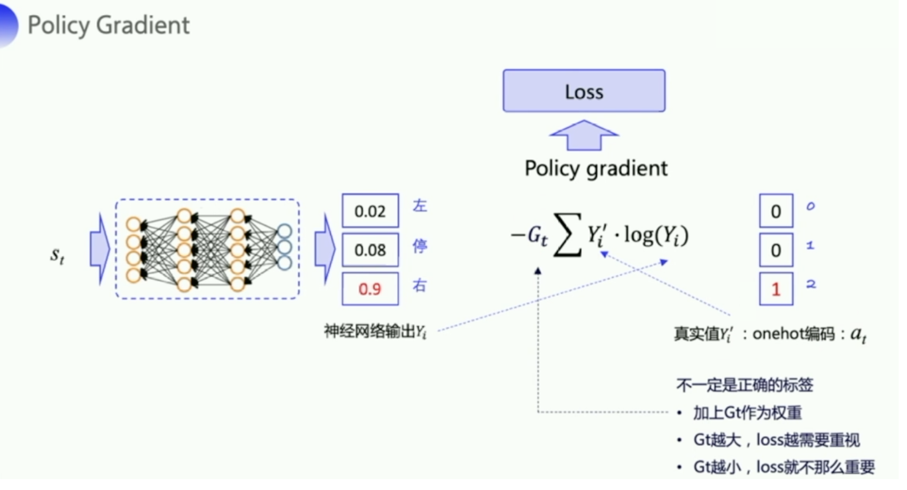
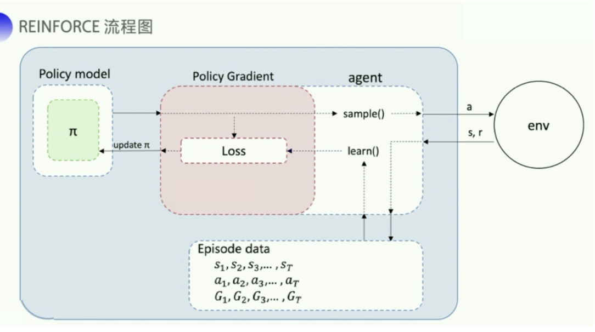

# 4 策略梯度

游戏环境中每一个轨迹发生的概率可以建模为：
$$
\begin{aligned}
\mathrm{p}_{\theta}(\mathrm{\tau}) &=\mathrm{p}\left(\mathrm{s}_{1}\right) \mathrm{p}_{\theta}\left(\mathrm{a}_{1} \mid \mathrm{s}_{1}\right) \mathrm{p}\left(\mathrm{s}_{2} \mid \mathrm{s}_{1}, \mathrm{a}_{1}\right) \mathrm{p}_{\theta}\left(\mathrm{a}_{2} \mid \mathrm{s}_{2}\right) \mathrm{p}\left(\mathrm{s}_{3} \mid \mathrm{s}_{2}, \mathrm{a}_{2}\right) \cdots \\
&=\mathrm{p}\left(\mathrm{s}_{1}\right) \prod_{\mathrm{t}=1} \mathrm{p}_{\theta}\left(\mathrm{a}_{\mathrm{t}} \mid \mathrm{s}_{\mathrm{t}}\right) \mathrm{p}\left(\mathrm{s}_{\mathrm{t}+1} \mid \mathrm{s}_{\mathrm{t}}, \mathrm{a}_{\mathrm{t}}\right)
\end{aligned}
$$
最终的总的奖励是一个随机变量，需要用期望表示：
$$
\bar{\mathrm{R}}_{\theta}=\sum_{\tau} \mathrm{R}(\tau) p_{\theta}(\tau)=\mathrm{E}_{\tau \sim \mathrm{p}_{\theta}(\tau)}[\mathrm{R}(\tau)]
$$
为了求得最大化的期望奖励，需要求梯度，为了更好地迭代，可以用期望表示梯度：
$$
\begin{aligned}
\nabla \bar{R}_{\theta} &=\sum_{\tau} \mathrm{R}(\mathrm{\tau}) \nabla \mathrm{p}_{\theta}(\mathrm{\tau}) \\
&=\sum_{\tau} \mathrm{R}(\mathrm{\tau}) \mathrm{P}_{\theta}(\tau) \frac{\nabla \mathrm{p}_{\theta}(\tau)}{\mathrm{p}_{\theta}(\mathrm{\tau})} \\
&=\sum_{\tau} \mathrm{R}(\tau) \mathrm{p}_{\theta}(\tau) \nabla \log \mathrm{p}_{\theta}(\tau) \\
&=\mathrm{E}_{\mathrm{\tau} \sim \mathrm{p}_{\theta}(\mathrm{\tau})}\left[\mathrm{R}(\mathrm{\tau}) \nabla \log \mathrm{p}_{\theta}(\tau)\right]
\end{aligned}
$$

此期望无法直接计算得到，因此只能通过采样获得，注意， $\mathrm{p}\left(\mathrm{s}_{1}\right)$ 和 $\mathrm{p}\left(\mathrm{s}_{\mathrm{t}+1} \mid \mathrm{s}_{\mathrm{t}}, \mathrm{a}_{\mathrm{t}}\right)$ 来自于环境， $\mathrm{p}_{\theta}\left(\mathrm{a}_{\mathrm{t}} \mid \mathrm{s}_{\mathrm{t}}\right)$ 是来自于 agent。$\mathrm{p}\left(\mathrm{s}_{1}\right)$ 和 $\mathrm{p}\left(\mathrm{s}_{\mathrm{t}+1} \mid \mathrm{s}_{\mathrm{t}}, \mathrm{a}_{\mathrm{t}}\right)$ 由环境决定, 所以与 $\theta$ 无关, 因此 $\nabla \log \mathrm{p}\left(\mathrm{s}_{1}\right)=0$ ， $\nabla \sum_{t=1}^{\mathrm{T}} \log \mathrm{p}\left(\mathrm{s}_{\mathrm{t}+1} \mid \mathrm{s}_{\mathrm{t}}, \mathrm{a}_{\mathrm{t}}\right)=0$：
$$
\begin{aligned}
\mathrm{E}_{\mathrm{\tau} \sim \mathrm{p}_{\theta}(\mathrm{\tau})}\left[\mathrm{R}(\mathrm{\tau}) \nabla \log \mathrm{p}_{\theta}(\mathrm{\tau})\right] & \approx \frac{1}{\mathrm{~N}} \sum_{\mathrm{n}=1}^{\mathrm{N}} \mathrm{R}\left(\mathrm{\tau}^{\mathrm{n}}\right) \nabla \log \mathrm{p}_{\theta}\left(\mathrm{\tau}^{\mathrm{n}}\right) \\
&=\frac{1}{N} \sum_{\mathrm{n}=1}^{\mathrm{N}} \sum_{\mathrm{t}=1}^{\mathrm{T}_{\mathrm{n}}} \mathrm{R}\left(\mathrm{\tau}^{\mathrm{n}}\right) \nabla \log \mathrm{p}_{\theta}\left(\mathrm{a}_{\mathrm{t}}^{\mathrm{n}} \mid \mathrm{s}_{\mathrm{t}}^{\mathrm{n}}\right)
\end{aligned}
$$
因此，通过算得的梯度更新参数：
$$
\nabla \bar{R}_{\theta}=\frac{1}{N} \sum_{\mathrm{n}=1}^{\mathrm{N}} \sum_{\mathrm{t}=1}^{\mathrm{T}_{\mathrm{n}}} \mathrm{R}\left(\tau^{\mathrm{n}}\right) \nabla \log \mathrm{p}_{\theta}\left(\mathrm{a}_{\mathrm{t}}^{\mathrm{n}} \mid \mathrm{s}_{\mathrm{t}}^{\mathrm{n}}\right)
$$
策略梯度算法每更新一次参数就会丢掉数据再重新搜集，这个问题会在之后被解决。

使用机器学习框架实现时，一般使用的是交叉熵损失函数前面加上权重。

## 4.1 Tips

### 4.1.1 Tip1：Add a Baseline

奖励始终是正值导致梯度更新没有按照理想方式进行（只想让最优的动作概率增加而不是所有动作，并且不同状态的奖励不一样，更新速度不一样），因此手动设置baseline保证部分奖励是负值：
$$
\nabla \bar{R}_{\theta} \approx \frac{1}{N} \sum_{n=1}^{N} \sum_{t=1}^{T_{n}}\left(R\left(\tau^{n}\right)-b\right) \nabla \log p_{\theta}\left(a_{t}^{n} \mid s_{t}^{n}\right) \quad b \approx E[R(\tau)]
$$
实际训练时，不断求轨迹奖励的平均值来更新$b$。

### 4.1.2 Tip2：Assign Suitable Credit

之前的公式将总的奖励加权给了每一步，实际上这是不合理的需要改进，因此可以只算当前动作之后产生的奖励：

但是使用了这个公式后$R-b$的值就不好估计了，所以采用神经网络的方法来估计，这种方法也被称作**优势函数**，衡量当前动作与其他动作相比的优势，用$A^{\theta}(s_t,a_t)$表示，叫做critic。

## 4.2 REINFORCE: Monte Carlo Policy Gradient

MC方法没回合更新一次，Q Learning单步更新。

下面介绍经典的**REINFORCE**算法，采用MC方法计算收益：

这个算法里的神经网络输出每一个动作的对应的概率值，采用one-hot向量表示。训练的loss采用交叉熵损失表示，表示方式类似于手写数字识别任务的计算方式：

神经网络给出动作空间中每一个动作的概率，然后使用`sample()`函数采样出一个动作去和环境交互：

