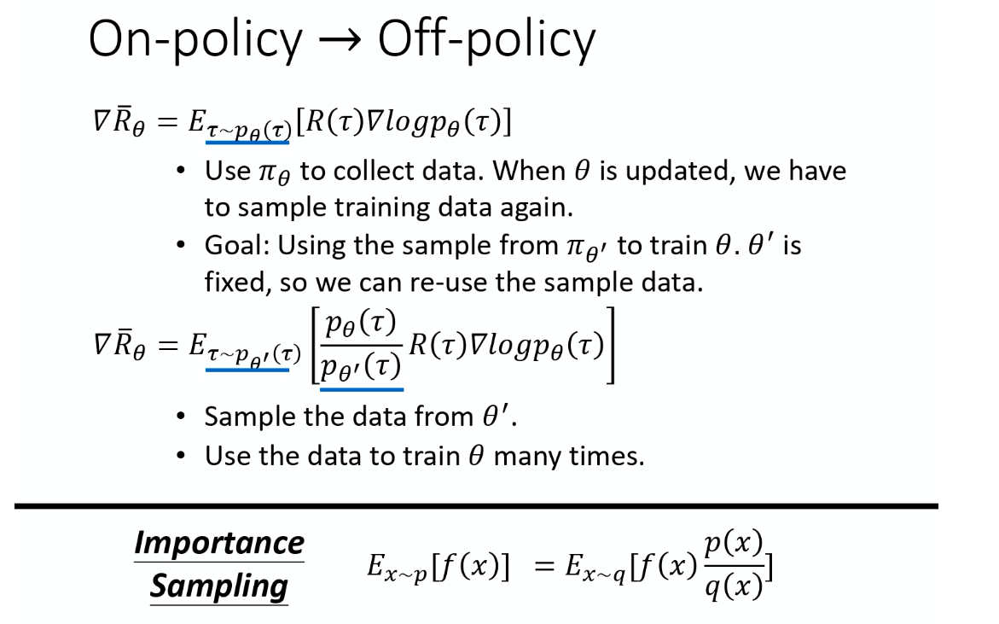
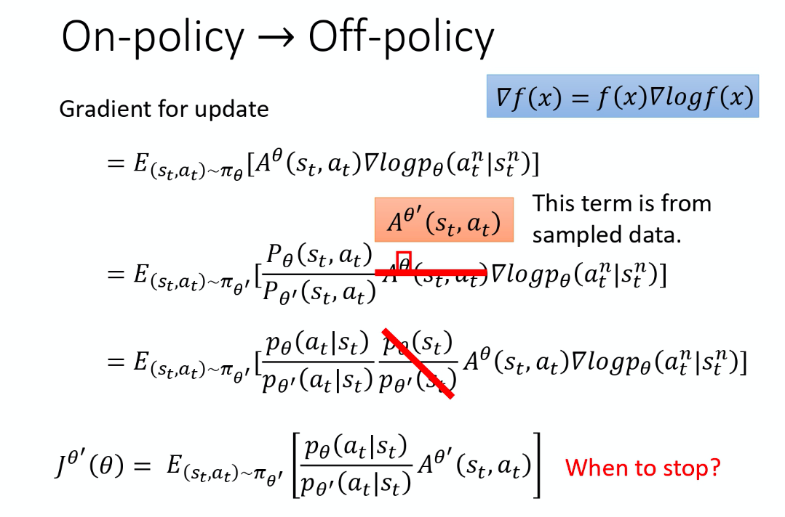
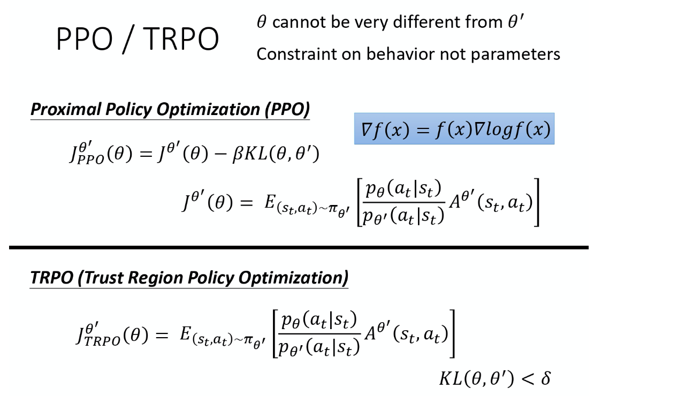
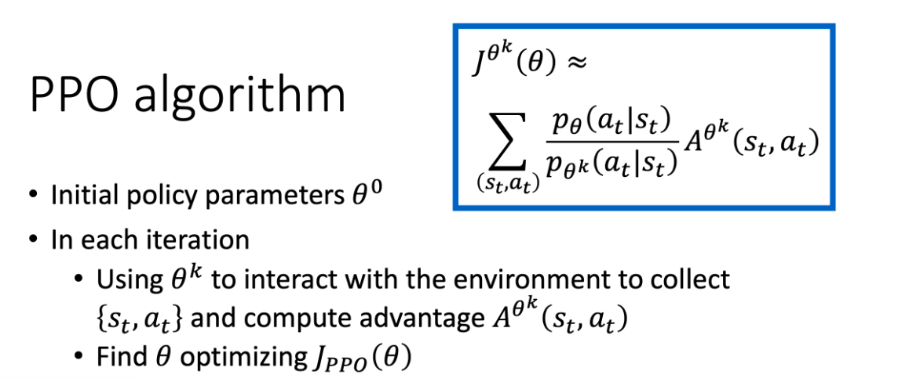
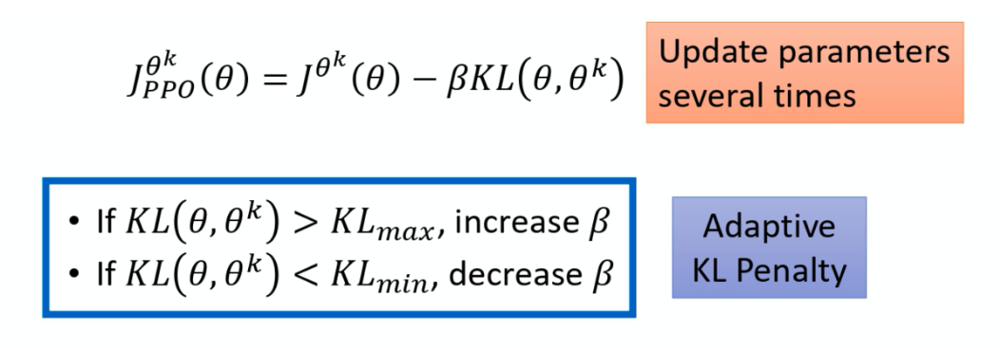
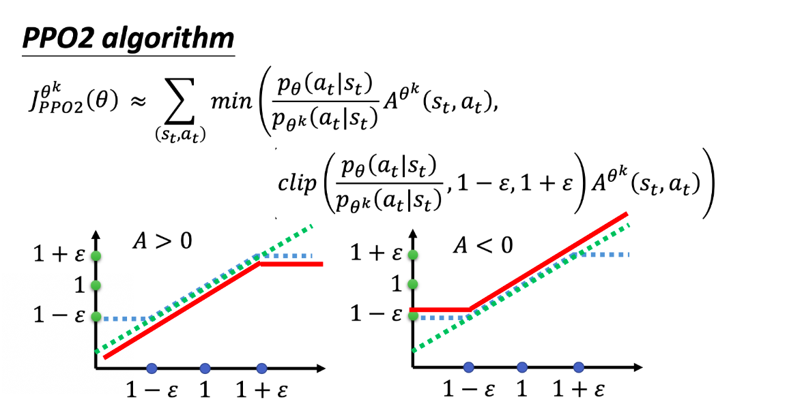

# 5 近端策略优化（PPO）算法

## 5.1 From On-policy to Off-policy

`近端策略优化(Proximal Policy Optimization，简称 PPO)` 是 policy gradient 的一个变形，它是现在 OpenAI 默认的强化学习算法。
$$
\nabla \bar{R}_{\theta}=\mathrm{E}_{\mathrm{\tau} \sim \mathrm{p}_{\theta}(\tau)}\left[\mathrm{R}(\mathrm{\tau}) \nabla \log \mathrm{p}_{\theta}(\mathrm{\tau})\right]
$$
上面公式中的$\mathrm{E}_{\mathrm{\tau} \sim \mathrm{p}_{\theta}(\tau)}$必须是现在的策略采样出来的期望，所以可以考虑使用另一个策略$\pi_{\theta^{\prime}}$搜集数据训练更新原来的$\theta$，而且搜集到的数据可以用很多次，这样的话效率更高。

具体实现off-policy的方法就是采用`重要性采样（Importance Sampling）`的概念。从分布p采样数据估计函数f(x)方法如下：
$$
E_{x \sim p}[f(x)] \approx \frac{1}{N} \sum_{i=1}^{N} f\left(x^{i}\right)
$$
如果要从分布q采样得到上述估计的话，不能直接采样，需要用如下形式：
$$
\int \mathrm{f}(\mathrm{x}) \mathrm{p}(\mathrm{x}) \mathrm{dx}=\int \mathrm{f}(\mathrm{x}) \frac{\mathrm{p}(\mathrm{x})}{\mathrm{q}(\mathrm{x})} \mathrm{q}(\mathrm{x}) \mathrm{dx}=\mathrm{E}_{\mathrm{x} \sim \mathrm{q}}\left[\mathrm{f}(\mathrm{x}) \frac{\mathrm{p}(\mathrm{x})}{\mathrm{q}(\mathrm{x})}\right]
$$
q(x)可以是任何分布，唯一限制情况是q(x)概率是0的时候，p(x)的概率不是0，两者都为0可以，有物理意义。

理论上可以把p换成任意的q，但实际上，p和q的差距不能过大，因为计算值的方差可以得到所求结果方差会收到p、q差别的影响。如果采样次数不够多，就可能产生很大的差距。

实际做policy gradient时，不是给整个轨迹一样的分数，而是采用如下形式：

advantage $A^{\theta}\left(s_{t}, a_{t}\right)$是优势函数，用来衡量每个状态动作对的值。上图是调整期望的方式，其中当$p_{\theta}(s_t)=p_{\theta^{\prime}(s_t)}$时，可以消掉这一项，对于确定环境来说这个确实能消掉。

我们获得了一个新的目标函数：
$$
\mathbf{J}^{\theta^{\prime}}(\theta)=\mathrm{E}_{\left(s_{t}, a_{t}\right) \sim \pi_{\theta^{\prime}}}\left[\frac{\mathrm{P}_{\theta}\left(\mathrm{a}_{\mathrm{t}} \mid \mathrm{s}_{\mathrm{t}}\right)}{\mathrm{P}_{\theta^{\prime}}\left(\mathrm{a}_{\mathrm{t}} \mid \mathrm{s}_{\mathrm{t}}\right)} \mathrm{A}^{\theta^{\prime}}\left(\mathrm{s}_{\mathrm{t}}, \mathrm{a}_{\mathrm{t}}\right)\right]
$$
其中，
$$
\nabla \mathrm{f}(\mathrm{x})=\mathrm{f}(\mathrm{x}) \nabla \log \mathrm{f}(\mathrm{x})
$$
更新参数是按照前面的式子更新$\theta$，所以写成$\theta$的函数。

## 5.2 PPO

为了避免$$
\mathrm{P}_{\theta}\left(\mathrm{a}_{\mathrm{t}} \mid \mathrm{s}_{\mathrm{t}}\right)
$$和$$
\mathbf{p}_{\theta^{\prime}}\left(\mathrm{a}_{\mathrm{t}} \mid \mathrm{s}_{\mathrm{t}}\right)
$$的分布差得太多，在 PPO 中 $\theta^{\prime}$ 是 $\theta_{\text {old }}$, 即 behavior policy 也是 $\theta$, 所以 PPO 是 on-policy 的算法。

为了不让两个策略网络分布差别不要太大，我们在训练的时候，多加一个约束(constrain)。这个约束是 $\theta^{\prime}$ 跟 $\theta$ 输出的动作的 KL 散度(KL divergence)，简单来说，这一项的意思就是要衡量说 $\theta$ 跟 $\theta^{\prime}$有多像。

### 5.2.1 PPO-Penalty

PPO 算法有两个主要的变种：PPO-Penalty 和 PPO-Clip。

原来的Policy-Gradient算法数据只能用一次，现在的PPO算法数据可以重复使用，因为采用了重要性采样的原则。

上图是PPO论文里的adaptive KL divergence，需要类似于正则化的方式动态调整$\beta$。设置KL散度的最大值和最小值，按照上图模式调整。

### 5.2.2 PPO-Clip

PPO-Clip中没有计算KL散度，需要优化的目标函数如下所示：
$$
\begin{aligned}
\mathrm{J}_{\mathrm{PPO}^{\mathrm{k}}}(\theta) \approx \sum_{\left(\mathrm{s}_{\mathrm{t}}, \mathrm{a}_{\mathrm{t}}\right)} \min \left(\frac{\mathrm{p}_{\theta}\left(\mathrm{a}_{\mathrm{t}} \mid \mathrm{s}_{\mathrm{t}}\right)}{\mathrm{p}_{\theta^{\mathrm{k}}}\left(\mathrm{a}_{\mathrm{t}} \mid \mathbf{s}_{\mathrm{t}}\right)} \mathrm{A}^{\theta^{\mathrm{k}}}\left(\mathrm{s}_{\mathrm{t}}, \mathrm{a}_{\mathrm{t}}\right)\right.\\
&\left.\operatorname{clip}\left(\frac{\mathrm{p}_{\theta}\left(\mathrm{a}_{\mathrm{t}} \mid \mathrm{s}_{\mathrm{t}}\right)}{\mathrm{P}_{\theta^{\mathrm{k}}}\left(\mathrm{a}_{\mathrm{t}} \mid \mathrm{s}_{\mathrm{t}}\right)}, 1-\varepsilon, 1+\varepsilon\right) \mathrm{A}^{\theta^{\mathrm{k}}}\left(\mathrm{s}_{\mathrm{t}}, \mathrm{a}_{\mathrm{t}}\right)\right)
\end{aligned}
$$
clip函数的含义是：

- 在括号里面有三项，如果第一项小于第二项的话，那就输出 $1-\varepsilon$。
- 第一项如果大于第三项的话，就输出$1+\varepsilon$。

其中，$\varepsilon$是超参数，可以自行设置调整，一般设置为0.1或0.2。

上图是讨论不同的优势函数对于最后形式的结果，本质上还是希望。这样设置的原因是：

- 如果A>0，我们希望这个动作的概率尽可能大，但是又不能太大，因此设置上限。
- 如果A<0，我们希望这个动作的概率尽可能小，但是不能太小，因此设置下限。
